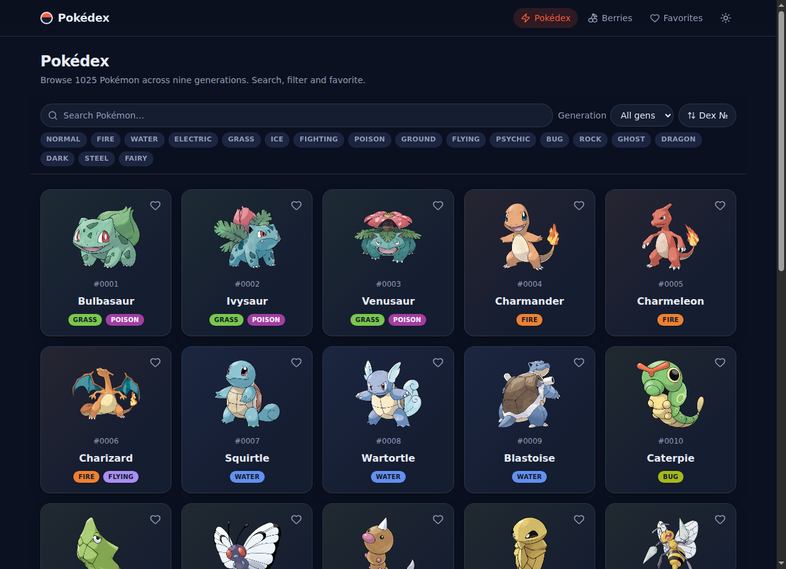
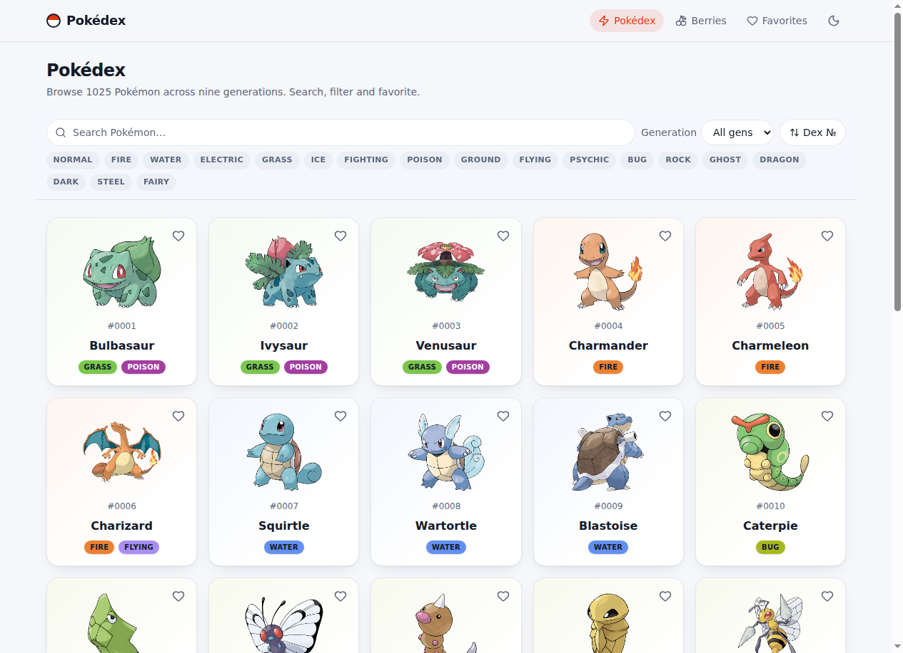
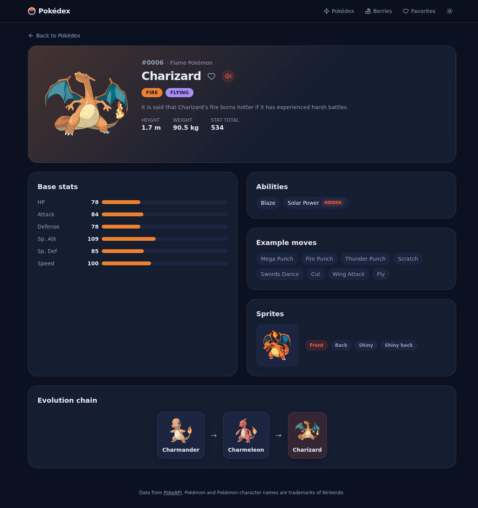
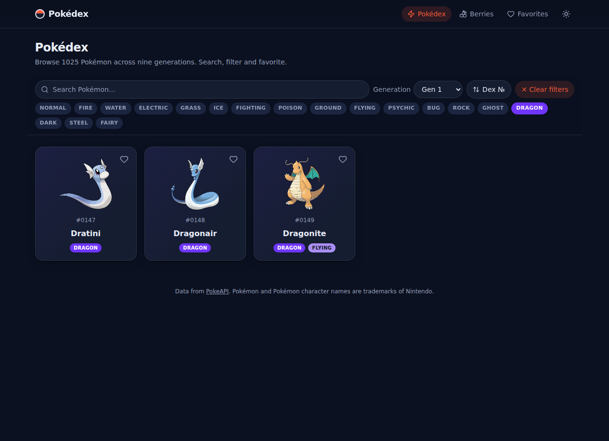
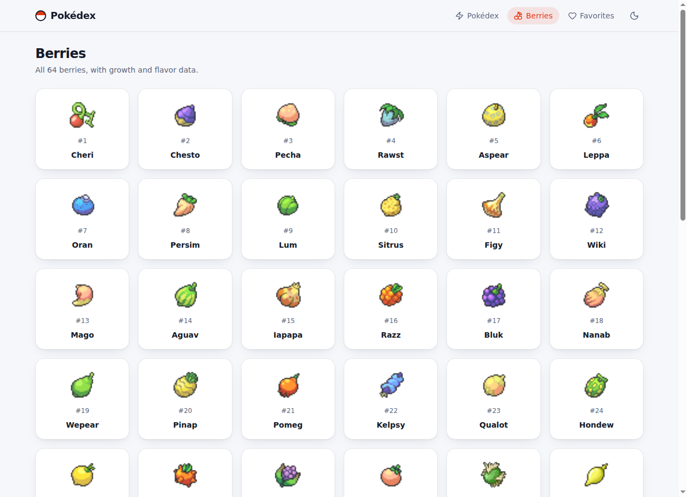
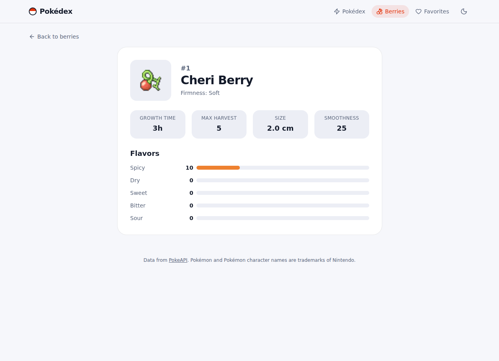
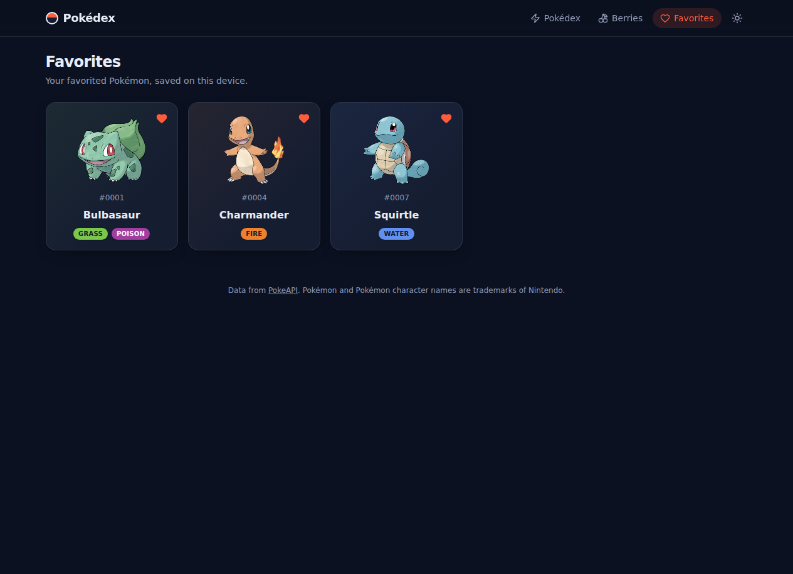

# ⚡ Pokédex

> A polished, animated Pokédex for all 1,025 Pokémon — search, filter, favorite, and explore berries. Built with SvelteKit + Svelte 5 runes, powered by [PokeAPI](https://pokeapi.co).

**[🔴 Live demo → azagatti.github.io/pokedex-off-fl1](https://azagatti.github.io/pokedex-off-fl1/)**

[](https://github.com/AZagatti/pokedex-off-fl1/actions/workflows/ci.yml) [](https://azagatti.github.io/pokedex-off-fl1/) [](https://svelte.dev) [](https://www.typescriptlang.org) [](https://tailwindcss.com) [](https://playwright.dev) [](https://vitest.dev)

<p align="center">
  
</p>

## ✨ Features

- **Browse all 1,025 Pokémon** in a responsive card grid with infinite scroll (30 per page), skeleton loaders, and tactile hover micro-animations
- **Instant search** (debounced 250 ms) by name
- **Filter by generation (1–9)** and **by type** (all 18, multi-select) — filters compose
- **Sort** by dex number or base-stat total
- **Rich detail pages**: official artwork with animated entrance, animated stat bars, abilities (hidden-ability tag), example moves, evolution chain, sprite-variant switcher (front/back/shiny), and a **play-cry audio button**
- **Berries section** with growth/flavor data and the same card aesthetic
- **Favorites** persisted to `localStorage` — heart any card or detail page
- **Dark/light theme** (persisted, respects `prefers-color-scheme`), fully keyboard-navigable, screen-reader-friendly, honors `prefers-reduced-motion`
- Every PokeAPI response is validated with **zod** schemas

| Light theme | Detail page | Filters |
| --- | --- | --- |
|  |  |  |

| Berries | Berry detail | Favorites |
| --- | --- | --- |
|  |  |  |

## 🧱 Tech stack

- **[SvelteKit](https://svelte.dev/docs/kit)** with **Svelte 5 runes**, TypeScript strict
- **[@sveltejs/adapter-static](https://svelte.dev/docs/kit/adapter-static)** — SPA mode with a `404.html` fallback, deployed to GitHub Pages
- **[Tailwind CSS v4](https://tailwindcss.com)** for layout + hand-written CSS for motion; **lucide-svelte** icons
- **[zod](https://zod.dev)** validation of every API response
- **[vitest](https://vitest.dev)** unit tests + **[Playwright](https://playwright.dev)** e2e tests
- **[ultracite](https://docs.ultracite.ai)** preset wiring **oxlint** + **oxfmt** (Rust-fast lint/format)
- **[lefthook](https://lefthook.dev)** git hooks — lint/format/typecheck pre-commit, tests pre-push
- **GitHub Actions** CI/CD → GitHub Pages

## 🚀 Run locally

```bash
git clone https://github.com/AZagatti/pokedex-off-fl1.git
cd pokedex-off-fl1
npm install
npm run dev          # http://localhost:5173
```

Other scripts:

```bash
npm run build        # static production build (build/)
npm run preview      # serve the production build
npm run test         # unit + e2e
npm run lint         # oxlint
npm run format       # oxfmt
npm run check        # svelte-check (typecheck)
```

## 🏗 Architecture (short version)

- **Static SPA**: `adapter-static` prerenders the shell for `/`, `/berries`, `/favorites`; dynamic routes (`/pokemon/[name]`, `/berries/[name]`) render client-side via the `404.html` fallback — perfect for GitHub Pages.
- **Data layer** (`src/lib/api/`): native `fetch` in SvelteKit `load` functions → a tiny in-memory **URL-keyed cache** with in-flight de-duplication → **zod** parsing. No data-fetching library.
- **State**: Svelte 5 runes classes for favorites and theme, both persisted to `localStorage`; the theme is applied pre-paint by an inline script to avoid a flash.
- **List pipeline**: name-list + generation/type sets are intersected client-side, then details are fetched per 30-item page as you scroll (IntersectionObserver).

Full details in [`docs/ARCHITECTURE.md`](docs/ARCHITECTURE.md); rationale for every pinned choice in [`docs/DECISIONS.md`](docs/DECISIONS.md).

## 📄 License & credits

Data and sprites from [PokeAPI](https://pokeapi.co). Pokémon and Pokémon character names are trademarks of Nintendo. This is a fan-made, non-commercial project.
